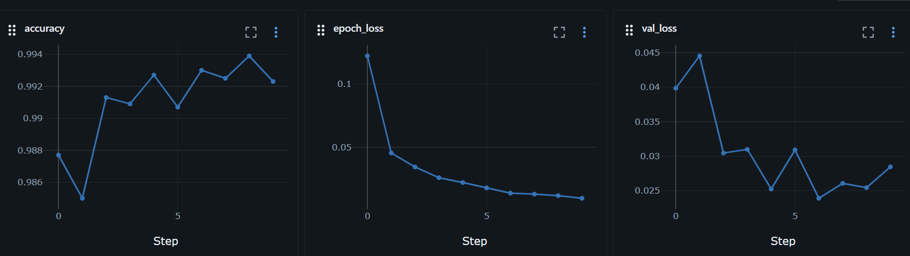
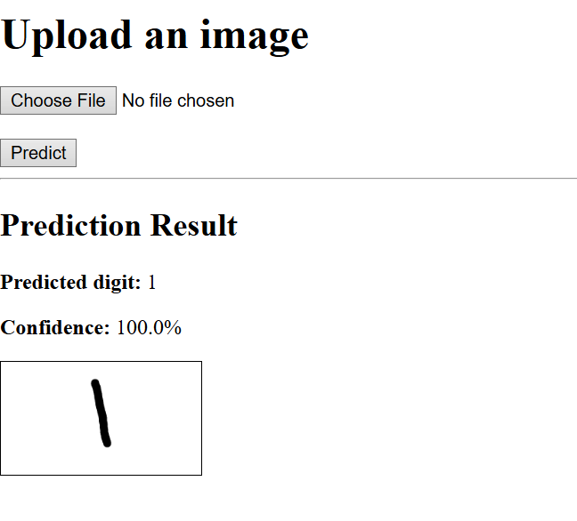
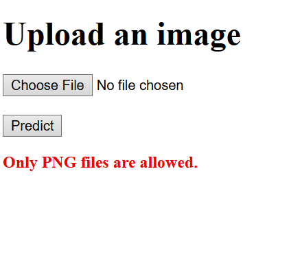

# CNN-number-prediction
## Project overview
### What is a convolutional neural network?
A convolutional neural network (CNN) is a type of machine learning model that is often used in image recognition.
### What data was used in this project?
* The model was created using a Modified National Institute of Standards (MNIST) dataset containing images with numbers 0 to 9 written on them
* Additionally the Windows application called Paint was used to create 3 additional images to test model working correctly
### How was this project completed?
* The training and testing MNIST datasets were downloaded and preprocessed to be used in the model
* Using the PyTorch library, a 12-layer CNN model was made to classify these images
* data augmentation and regularization was applied to improve model generalization
* The model was then trained and evaluated over 10 epochs and the best model was saved
* It achieved a validation accuracy of 99.5% 
* The best model was then used to classify the three images made in Paint where it was 100\% accurate

## MLOps Implementation (WIP)
### Training results

* epoch_loss is the average training loss
* val_loss is the average validation loss 
### Testing
The project includes a suite of automated tests using `pytest` to ensure model reliability and input validation.

<details>
<summary>View Test Results</summary>

```bash
================================================== test session starts ==================================================
platform win32 -- Python 3.11.5, pytest-9.0.2, pluggy-1.6.0
rootdir: C:\Users\joelb\Documents\GitHub\CNN_number_prediction
configfile: pytest.ini
plugins: anyio-4.12.0
collected 5 items                                                                                                        

tests\test_model.py .....                                                                                          [100%]

=================================================== 5 passed in 6.16s =================================================== 
```

</details>

### FastAPI Integration
Have now implementd Fast API and HTML code to allow users to be able to upload images for the model to try and predict.

<details>
<summary>succesful_upload</summary>
  


</details>

<details>
  
<summary>no_upload</summary>


</details>

<details>
  
<summary>wrong_file</summary>



</details>

For a higher chance of a succesful prediction, images must a whole number between 0 and 9  on a white background. 

<details>
  
<summary>For example</summary>


</details>

* Containerization (Docker), Deployment (Cloud Run)

## Live Service (WIP)
* A clickable link to the live hosted API and a clear explanation of how to use it.
